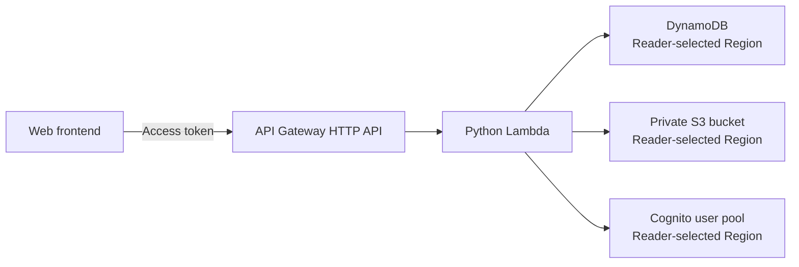

# Deploy the serverless backend

This section starts with an AWS account that has none of the project resources
yet. It creates the prerequisites and then deploys the Todo and Note API as one
Python AWS Lambda function behind an Amazon API Gateway HTTP API. The function
uses Amazon DynamoDB for application data, Amazon S3 for private attachments,
and Amazon Cognito for authentication.

The deployment is split into four parts:

1. [5.4.1 Prepare the backend](./5.4.1-prepare/)
2. [5.4.2 Create the Lambda function](./5.4.2-create-lambda-function/)
3. [5.4.3 Configure API Gateway](./5.4.3-configure-api-gateway/)
4. [5.4.4 Test the endpoint](./5.4.4-test-endpoint/)

## Deployment architecture

The project does not require a Dockerfile. Lambda receives a ZIP archive whose
root contains the Python modules. `boto3` is supplied by the Lambda Python
runtime, and this backend has no additional third-party runtime dependency.

## Project-specific deployment boundary

The supplied `api/openapi.yaml` documents the HTTP contract, but it does not
contain `x-amazon-apigateway-integration` definitions. Importing it does not
create a complete Lambda integration or JWT authorizer. Configure the HTTP API
integration, routes, authorizer, and CORS as described in section 5.4.3.

Resource identifiers and tokens are represented by placeholders throughout
these instructions. Do not commit an AWS account ID, Cognito app client secret,
access token, or presigned S3 URL to a shared repository.

The reader chooses every resource name and Region. Using one Region for all
resources is the simplest first deployment. Separate Regions are also supported
when `DYNAMODB_REGION`, `S3_REGION`, and `COGNITO_REGION` are configured
correctly.

## AWS references

- [Deploying Lambda functions as ZIP archives](https://docs.aws.amazon.com/lambda/latest/dg/configuration-function-zip.html)
- [Working with Lambda environment variables](https://docs.aws.amazon.com/lambda/latest/dg/configuration-envvars.html)
- [API Gateway HTTP APIs](https://docs.aws.amazon.com/apigateway/latest/developerguide/http-api.html)
- [HTTP API JWT authorizers](https://docs.aws.amazon.com/apigateway/latest/developerguide/http-api-jwt-authorizer.html)
- [Create a DynamoDB table](https://docs.aws.amazon.com/amazondynamodb/latest/developerguide/getting-started-step-1.html)
- [Create an S3 bucket](https://docs.aws.amazon.com/AmazonS3/latest/userguide/create-bucket-overview.html)
- [Cognito app clients](https://docs.aws.amazon.com/cognito/latest/developerguide/user-pool-settings-client-apps.html)
