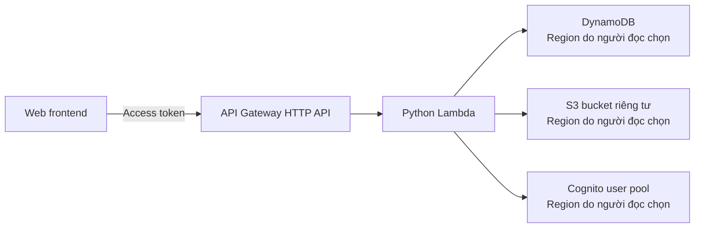

# Triển khai backend serverless

Phần này bắt đầu từ một AWS account chưa có resource nào của dự án. Người đọc
sẽ tạo các resource cần thiết, sau đó triển khai Todo and Note API bằng một AWS
Lambda Python đặt phía sau Amazon API Gateway HTTP API. Lambda sử dụng Amazon
DynamoDB để lưu dữ liệu, Amazon S3 để lưu tệp đính kèm riêng tư và Amazon
Cognito để xác thực.

Quy trình gồm bốn phần:

1. [5.4.1 Chuẩn bị backend](./5.4.1-prepare/)
2. [5.4.2 Tạo Lambda function](./5.4.2-create-lambda-function/)
3. [5.4.3 Cấu hình API Gateway](./5.4.3-configure-api-gateway/)
4. [5.4.4 Kiểm thử endpoint](./5.4.4-test-endpoint/)

## Kiến trúc triển khai

Dự án không cần Dockerfile. Lambda nhận một tệp ZIP có các module Python nằm
ngay tại thư mục gốc. Runtime Python của Lambda đã cung cấp `boto3`, còn backend
này không sử dụng thư viện runtime bên thứ ba nào khác.

## Phạm vi của tài liệu API

Tệp `api/openapi.yaml` mô tả HTTP contract nhưng không có các khai báo
`x-amazon-apigateway-integration`. Vì vậy, chỉ import tệp này sẽ không tạo đầy
đủ Lambda integration hoặc JWT authorizer. Hãy cấu hình integration, route,
authorizer và CORS theo phần 5.4.3.

Tất cả resource ID và token trong tài liệu đều dùng placeholder. Không đưa AWS
account ID, Cognito app client secret, access token hoặc presigned S3 URL vào
repository dùng chung.

Người đọc tự chọn tên và Region cho tất cả resource. Dùng cùng một Region cho
toàn bộ resource là cách đơn giản nhất khi triển khai lần đầu. Vẫn có thể dùng
nhiều Region nếu cấu hình đúng `DYNAMODB_REGION`, `S3_REGION` và
`COGNITO_REGION`.

## Tài liệu AWS tham khảo

- [Triển khai Lambda bằng tệp ZIP](https://docs.aws.amazon.com/lambda/latest/dg/configuration-function-zip.html)
- [Biến môi trường của Lambda](https://docs.aws.amazon.com/lambda/latest/dg/configuration-envvars.html)
- [API Gateway HTTP APIs](https://docs.aws.amazon.com/apigateway/latest/developerguide/http-api.html)
- [JWT authorizer cho HTTP API](https://docs.aws.amazon.com/apigateway/latest/developerguide/http-api-jwt-authorizer.html)
- [Tạo DynamoDB table](https://docs.aws.amazon.com/amazondynamodb/latest/developerguide/getting-started-step-1.html)
- [Tạo S3 bucket](https://docs.aws.amazon.com/AmazonS3/latest/userguide/create-bucket-overview.html)
- [Cognito app clients](https://docs.aws.amazon.com/cognito/latest/developerguide/user-pool-settings-client-apps.html)
